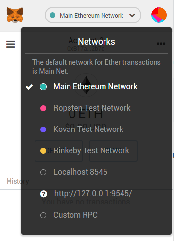
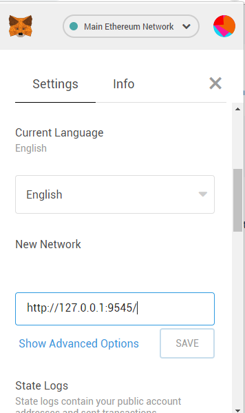
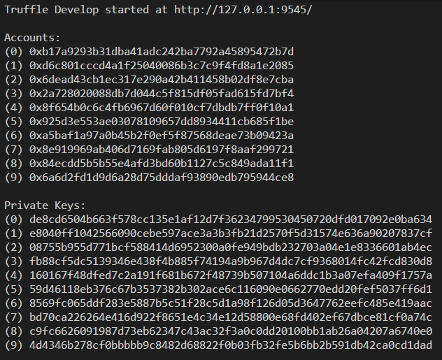
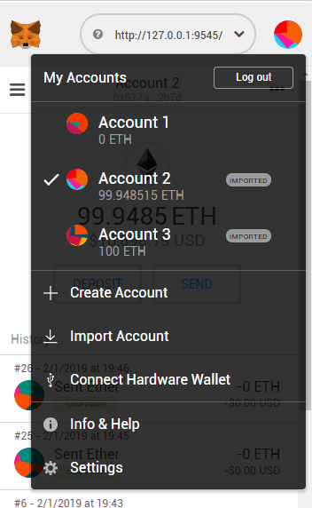
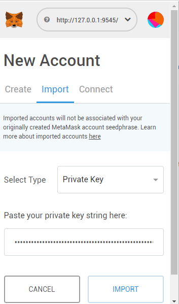

# Project 5: Star Notary Dapp on Ethereum

This is the 5th project for the Blockchain Developer Nanodegree. The project is built upon the boiler plate code provided for a Star Notary service utilising the ERC-721 standard. It is deployed on the Rinkeby Ethereum Testnet with the following details:

Token Name: [**Star Deed**](https://rinkeby.etherscan.io/tokens?q=0x3f0e08b275De4975Bc1dF73F41180F2788155493)  
Token Symbol: **SDT**  
Contract Address: [**0x3f0e08b275De4975Bc1dF73F41180F2788155493**](https://rinkeby.etherscan.io/address/0x3f0e08b275de4975bc1df73f41180f2788155493)


## Getting Started

These instructions will get you a copy of the project up and running on your local machine for development and testing purposes. See deployment for notes on how to deploy the project on a live system.

### Prerequisites

This project requires the following:
* [nodejs](https://nodejs.org) and npm (included in the nodejs install)
* [Truffle](https://truffleframework.com/truffle)
* [Metamask](https://metamask.io/)
* [Infura](https://infura.io) (required for non-local deployment)

To install truffle (after installing nodejs):
```
npm install truffle -g
```

### Installing

To deploy the contract for review:
1. Download the project.
1. Run the command `npm install` to install the project dependencies.
1. Create a `.secret` file in the base directory. This file can be empty however, if you want to deploy to an Ethereum test network or the main network, you will need to paste your mnemonic phrase into this file.
1. Compile and deploy the contract in a local development environment:

```
> truffle develop
truffle(develop)> compile
truffle(develop)> migrate --reset
```

To deploy the front end of the DAPP for review:
1. Prepare the environment for the DAPP front end by installing the dependencies and deploying. Type the following into a separate terminal window:
```
cd app
npm install
npm run dev
```

Open the front end by visiting [`http://127.0.0.1:8080`](http://127.0.0.1:8080)

#### Using the front end in develop mode
To use the front end, you will need to choose the correct network in metamax and import at least one account from the truffle development environment into metamax.

##### Choosing the correct network in metamask

To choose the correct network in metamask, click on the network at the top of the window to open a drop down box as illustrated below:



Click on the `Custom RPC` option and scroll down to the **New Network** option and enter the truffle development network (the address for this network can be seen in the truffle screenshot in the next section) before hitting save:



You can now choose this network from the network drop down box. Choose this network now so you can work with the truffle develop environment.

##### Importing an account into metamask from truffle
Below is an example of what you will see when you first enter the truffle develop mode (`truffle develop`).



Copy any of the private keys from the output on your terminal screen.

To import into metamask, click on the account icon at the top right of metamask and select **Import Account**:



Paste your private key into the box in click **IMPORT**:



You can now use the front end of the DAPP with the account selected in metamask (and the correct local network!). If you want to change accounts (to claim a star under a different account), you will need to reload the DAPP web page once you have selected the correct account in metamask.

## Running the tests

Run the tests for the contract by running the test command in the truffle development environment:

```
> truffle develop
truffle(develop)> test
```

## Deployment

To deploy the project on the rinkeby test network:
1. Save your mnemonic phrase in a file called `./.secret` (this phrase is obtained from metamask).
2. Use truffle to deploy the contract:

```
truffle migrate --reset --network rinkeby
```

## Reviewing the Project Code

### Add contract token name and symbol
From `./contracts/StarNotary.sol`:
```
// Implement Task 1 Add a name and symbol properties
// Token name
string public constant name = "Star Deed";
// Token symbol
string public constant symbol = "SDT";
```

### Implement lookUptokenIdToStarInfo function
From `./contracts/StarNotary.sol`:
```
// Implement Task 1 lookUptokenIdToStarInfo
function lookUptokenIdToStarInfo(uint _tokenId) public view returns (string memory) {
    return tokenIdToStarInfo[_tokenId].name;
}
```

### Implement exchangeStars function
From `./contracts/StarNotary.sol`:
```
// Implement Task 1 Exchange Stars function
function exchangeStars(uint256 _tokenId1, uint256 _tokenId2) public {
    address ownerAddress1 = ownerOf(_tokenId1);
    address ownerAddress2 = ownerOf(_tokenId2);

    require(msg.sender == ownerAddress1 || msg.sender == ownerAddress2, 'Sender must own one of the stars');
    _transferFrom(ownerAddress1, ownerAddress2, _tokenId1);
    _transferFrom(ownerAddress2, ownerAddress1, _tokenId2);
}
```

### Implement transferStar function
From `./contracts/StarNotary.sol`:
```
// Implement Task 1 Transfer Stars
function transferStar(address _to1, uint256 _tokenId) public {
    address ownerAddress = ownerOf(_tokenId);

    require(msg.sender == ownerAddress, 'Sender must own star to transfer');
    _transferFrom(ownerAddress, _to1, _tokenId);
}
```

### Implement supporting unit tests
From `./test/TestStarNotary.js`:
```
// Implement Task 2 Add supporting unit tests
it('can add the star name and star symbol properly', async() => {
    let tokenId = 6;
    await instance.createStar('New Star!', tokenId, {from: accounts[0]});

    assert.equal(await instance.name.call(), "Star Deed");
    assert.equal(await instance.symbol.call(), "SDT");
});

it('lets 2 users exchange stars', async() => {
    let tokenId1 = 7;
    let tokenId2 = 8;
    await instance.createStar('New Star 1!', tokenId1, {from: accounts[0]});
    await instance.createStar('New Star 2!', tokenId2, {from: accounts[1]});

    instance.exchangeStars(tokenId1, tokenId2);

    assert.equal(await instance.ownerOf(tokenId1), accounts[1]);
    assert.equal(await instance.ownerOf(tokenId2), accounts[0]);
});

it('lets a user transfer a star', async() => {
    let tokenId = 9;
    await instance.createStar('New Star!', tokenId, {from: accounts[0]});

    instance.transferStar(accounts[1], tokenId);
    assert.equal(await instance.ownerOf(tokenId), accounts[1]);
});
```

### Deploy to Rinkeby
Deployment to Rinkeby requires the user's mnemonic phrase to be saved in a file called `./.secret`.

Configuration from `truffle-config.js`:
```
const infuraKey = "aea718a531d949c59204219998db790d";
const mnemonic = fs.readFileSync(".secret").toString().trim();
...
rinkeby: {
    provider: () => new HDWalletProvider(mnemonic, `https://rinkeby.infura.io/v3/${infuraKey}`),
    network_id: 4,       // rinkeby's id
    gas: 4500000,        // rinkeby has a lower block limit than mainnet
    gasPrice: 10000000000
}
```

### Implement lookUp function
From `./app/src/index.js`:
```
// Implement Task 4 Modify the front end of the DAPP
lookUp: async function () {
    const { lookUptokenIdToStarInfo } = this.meta.methods;
    const id = document.getElementById("lookid").value;
    const name = await lookUptokenIdToStarInfo(id).call();
    if (name == "") {
        App.setStatus(`Star ${id} has not been claimed`);
    } else {
        App.setStatus(`Star name is "${name}"`);
    }
}
```
